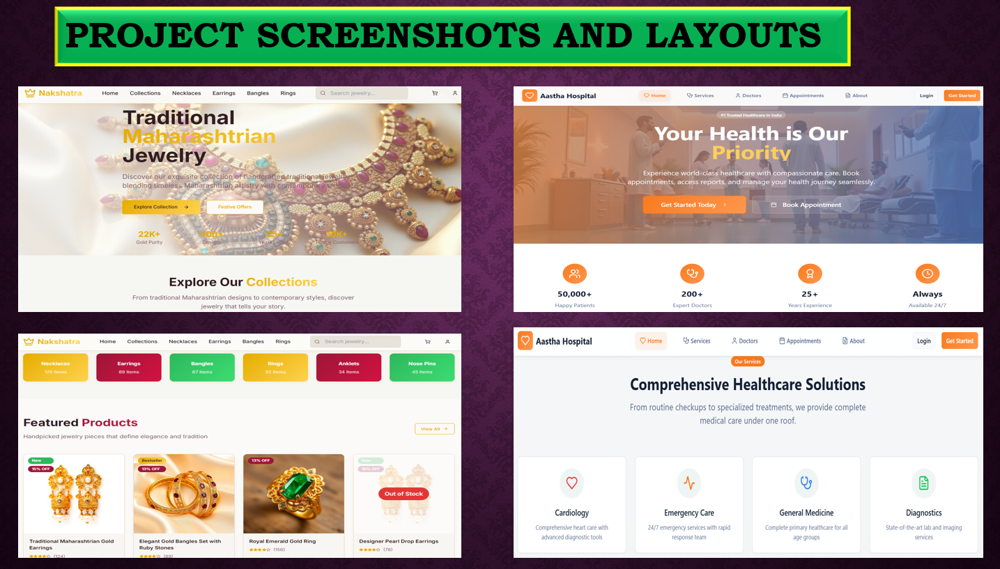

# RSB Web Development Internship

### Project Overview
This internship focused on **UI/UX design and frontend development** at RSB Enterprises. The work includes **responsive web pages, wireframes, prototypes, and frontend integration** to enhance user experience.

### Objectives
- Create responsive and interactive web pages
- Design wireframes and prototypes in Figma/Adobe XD
- Integrate APIs and ensure smooth functionality
- Apply analytical thinking to debug and optimize code

### Tools & Technologies
- **Frontend:** React.js, Tailwind CSS, Bootstrap, HTML, CSS
- **Design:** Figma, Adobe XD
- **Collaboration:** GitHub, Jira, Agile methodology

### Key Files in Repository
- `Internship_Report.pdf` – Detailed internship report
- `Internship_Presentation.pdf` – Presentation slides summarizing work

### Output / Visuals
Screenshots and visual examples of the UI/UX projects, prototypes, and final responsive pages.
 

### Outcome / Achievements
- Completed internship projects focusing on **UI/UX design and frontend development**
- Developed professional wireframes and interactive prototypes
- Gained hands-on experience with React, Tailwind CSS, and Agile collaboration

### Notes
This report and presentation were **originally submitted as part of the academic requirements** and are shared here for **learning and portfolio purposes**. All content reflects my internship contribution, and no changes have been made to the original submission.
